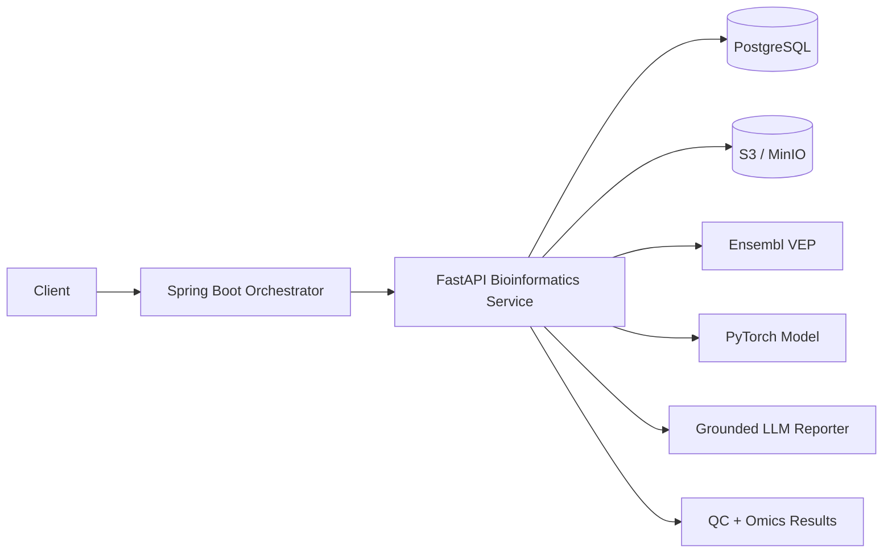

# HelixInsight AI

Portfolio-grade **Genomics & Multi-Omics Analysis Platform** combining bioinformatics, AI, cloud, and distributed systems.

> Research/education software only. It is not a diagnostic device and must not be used for clinical decisions.

## What it does

1. Upload DNA/RNA sequence, variant, or expression datasets.
2. Run sequence QC for FASTA/FASTQ using Biopython.
3. Analyze gene-expression matrices and rank candidate biomarkers.
4. Parse VCF variants and optionally request consequence annotations from Ensembl VEP.
5. Score biomarker candidates with a reproducible PyTorch model trained only on supplied/labeled data.
6. Generate evidence-grounded biological reports where every claim is linked to captured evidence.
7. Expose a Java Spring Boot orchestration API for enterprise integration.
8. Run locally with Docker Compose and deploy to AWS with Kubernetes/Terraform foundations.

## Architecture



## Repository layout

- `services/bio-api` — FastAPI, Biopython, Scanpy-ready expression analysis, PyTorch scoring.
- `services/orchestrator` — Java 17 / Spring Boot orchestration layer.
- `infra/k8s` — Kubernetes manifests.
- `infra/terraform` — AWS S3/RDS/EKS-ready Terraform foundation.
- `samples` — small synthetic/non-clinical demo inputs.
- `.github/workflows` — Python + Java CI.

## Local quick start

```bash
cp .env.example .env
docker compose up --build
```

FastAPI: `http://localhost:8000/docs`  
Spring Boot: `http://localhost:8080/api/health`

## Example workflow

```bash
curl -F 'file=@samples/sample.fastq' http://localhost:8000/v1/qc/sequence
curl -F 'file=@samples/expression.csv' http://localhost:8000/v1/expression/analyze
curl -F 'file=@samples/sample.vcf' http://localhost:8000/v1/variants/analyze
```

## Portfolio talking points

- Designed a polyglot Java/Python platform separating enterprise orchestration from scientific compute.
- Implemented reproducible bioinformatics QC, variant parsing, expression feature ranking, and model provenance.
- Added evidence-grounded report generation to reduce unsupported LLM claims.
- Containerized services and supplied Kubernetes, AWS Terraform, CI/CD, persistence, and object-storage integration.

## Next production milestones

- Add signed S3 multipart uploads and background jobs with Kafka.
- Add real cohort metadata, batch correction, differential expression, and model-validation pipelines.
- Add OpenTelemetry, Prometheus/Grafana, auth (OAuth2/OIDC), RBAC, audit trails, and SBOM/container scanning.
- Replace demo model with validated task-specific models and public benchmark datasets.
